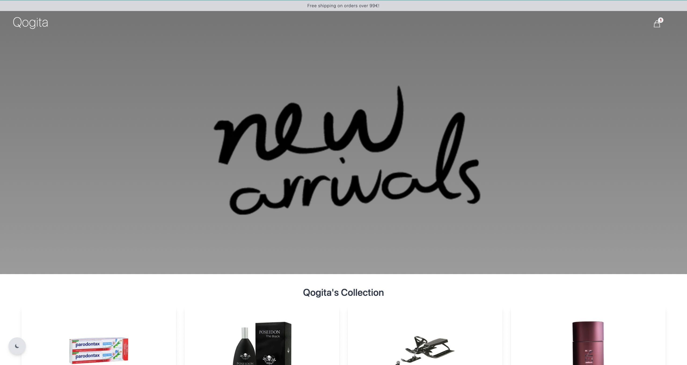

# Overview



## Demo

You can follow the [link](https://www.pavkout.click/) to see the online demo.

## Used Stack

- [TypeScript](https://www.typescriptlang.org/)
- [Vue](https://vuejs.org/)
- [Nuxt3](https://v3.nuxtjs.org/)
- [Tailwind CSS](https://tailwindcss.com/)

## Shopping Cart

- [x] Display paginated products.
- [x] Add products to shopping cart.
- [x] Quick add product by clicking a button.
- [x] Display product details. (Modal).
- [x] Shoping cart with selected products.
- [x] Change quantity of the product from shopping cart.
- [x] Remove products from shopping cart.
- [x] Erase cart.
- [x] Confirmation for deleting products.
- [x] Dark/Light Theme.
- [x] Still exist the cart after reload the page.
- [x] Display toast for user actions.

## Features

- [x] Mobile Friendly.
- [x] Full Accessibility.

## Tests (vitest)

- [x] Test Files: 2 passed
- [x] Tests: 24 passed

## Getting started

The existing code includes a development environment, and an [API](#api) with product data for you to interact with. The relevant API response types can be found in [src/types.ts](src/types.ts). Please do not use `data/products.json` directly.

### Setup

```sh
yarn install
```

### Running locally

## Development Server

Start the development server on http://localhost:3000

```bash
npm run dev
```

## Production

Build the application for production:

```bash
npm run build
```

Locally preview production build:

```bash
npm run preview
```

Run all the tests.

```sh
yarn test
```

Run all the tests with UI.

```sh
yarn test:ui
```

Run tests coverage.

```sh
yarn coverage
```

## API

The API can be interacted with via `http://localhost:3000/api` and has the following endpoints:

#### `/products`

The `/products` endpoint accepts `GET` requests and will return the first page of 20 products. To retrieve a different page of 20 products, you can pass the `page` query parameter (e.g. `/products?page=2`).

#### `/products/[gtin]`

The `/products/[gtin]` endpoint accepts `GET` requests and will return a product matching the GTIN (e.g. `/products/8005610625720`). If no product is found, the API will respond with a `404` status.
